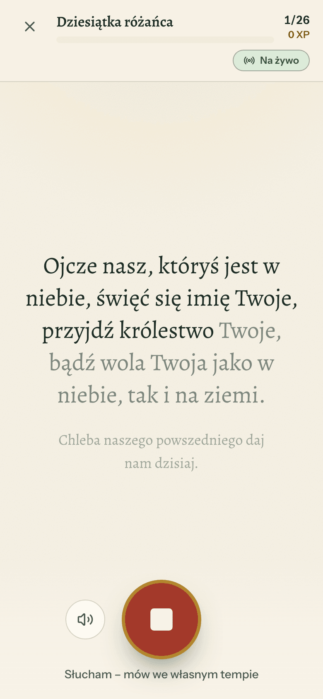
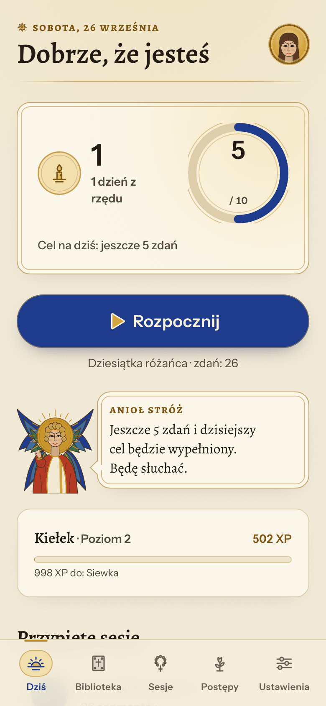
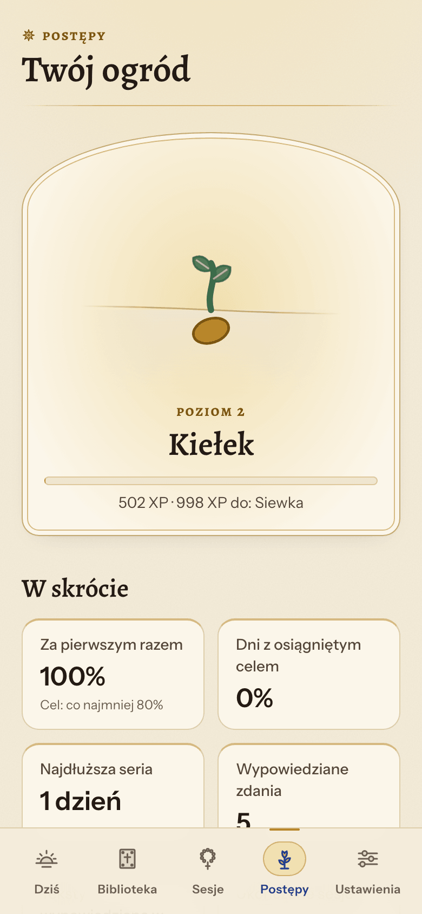

# Teleo – modlitwy i afirmacje · prayers & affirmations

> gr. *τελέω* — "to bring to completion, to fulfil". Don't just read it — **say it, and finish it.**

Teleo is a free, local-first Progressive Web App that helps you speak prayers, affirmations and
passages **aloud**, sentence by sentence. Speech recognition transcribes what you said, a matcher
compares it with the source text (≥ 95% of the words, zero extra words) and only verified sentences
count. Repetitions, streaks, levels and achievements grow a quiet little garden — no accounts, no
servers, no tracking. Polish 🇵🇱 and English 🇺🇸.

- **Private by design:** all data lives in your browser (IndexedDB). Nothing is sent to us — there is
  no "us" server. Exception: in some browsers (e.g. Chrome) the built-in Web Speech recognizer sends
  audio to the browser vendor; the app says so before the first use. Audio is never stored.
- **Works offline** once installed (speech recognition may need the network, see above).
- **Costs nothing to run:** static files on GitHub Pages.

<p align="center">
  
  
  
</p>

## What it does

- **Live listening (default):** start a session, tap the microphone once and just keep praying — each
  sentence is checked as you speak it; heard words ink in, a finished sentence gets a quiet “Great!”
  and the next one is already listening. Repeated items show a counter (`Zdrowaś Maryjo · 3/10`).
  Tap mode (one utterance per tap) is one switch away.
- **Honest checking:** a sentence counts when ≥ 95 % of its words were said and nothing was added
  (small recognition slips such as missing Polish letters are forgiven; fillers like “um” ignored).
- **Texts & sessions:** builtin public-domain prayers (PL/EN, incl. the Rosary decade and Psalm 23)
  and original affirmations, your own texts with automatic sentence/line splitting and manual
  split/merge, sessions of up to 150 sentences with repetitions and drag-and-drop ordering.
- **Calm gamification:** XP, 20 plant-themed levels (then “circles”), 49 achievements (every text gets
  its own automatically), streaks with freezes, daily goal, comeback and “steady rhythm” rewards.
- **Memory mode & listen first:** say a text from memory (first letters → every other word → hidden;
  words appear as you say them) and optionally hear each sentence read aloud before you say it.
- **Progress:** heatmap, weekly first-try success, per-text statistics, achievement gallery.
- **Yours only:** JSON backup export/import, calendar (.ics) reminders, delete-everything, PL/EN UI,
  light/dark theme, three text sizes, keyboard (Space = microphone), screen stays on in sessions.

Product spec: [docs/TELEO_SPEC.md](docs/TELEO_SPEC.md) · decisions: [docs/DECISIONS.md](docs/DECISIONS.md)
· implementation plan: [docs/superpowers/plans/2026-09-25-teleo-v1.md](docs/superpowers/plans/2026-09-25-teleo-v1.md)

## Development

Requirements: Node ≥ 22.22 (24 recommended), npm.

```bash
npm ci
npm run dev          # http://localhost:5173/teleo/
npm run test         # unit + component tests (Vitest, watch mode)
npm run test:e2e     # end-to-end (Playwright; first run: npx playwright install chromium)
npm run lint         # oxlint
npm run build        # type-check + production build → dist/
npm run preview      # serve the production build at http://localhost:4173/teleo/
```

Speech recognition needs a secure context: `localhost` works; on a phone use the deployed HTTPS URL.

End-to-end tests replace `SpeechRecognition` with a scriptable fake (`e2e/fakeSpeech.ts`) that
"says" the sentence on screen — in echo (tap) or streaming (live) mode. Playwright's headless shell
has no speech service (calling the real `SpeechRecognition.available()` crashes it), so every test
that reaches a microphone screen installs the fake.

## Deploying to GitHub Pages (free)

The GitHub Free plan only serves Pages from **public** repositories.

1. Create a public repository named `teleo` (the app is built for the `/teleo/` path; for another
   name change `BASE` in `vite.config.ts`).
2. Push `main`:
   ```bash
   gh repo create teleo --public --source . --remote origin --push
   ```
3. Repository → **Settings → Pages → Source: GitHub Actions**.
4. Every push to `main` runs `.github/workflows/deploy.yml` (lint, tests, build, deploy). The app
   appears at `https://<user>.github.io/teleo/`.

Pull requests run `.github/workflows/ci.yml` (lint, type-check, unit and e2e tests).

## Project layout

```
src/domain/     pure business rules (segmenter, matcher, gamification, sessions, time) + unit tests
src/db/         Dexie (IndexedDB) schema and row types
src/services/   DB-coupled use cases (one transaction per user event)
src/screens/    route screens · src/components/ shared UI · src/i18n/ PL + EN strings
public/         icons, privacy policy · e2e/ Playwright tests
```

## Licence & content

Code licence: not chosen yet — add a `LICENSE` file before publishing. Builtin texts are traditional public-domain prayers (Polish liturgical wording, English
traditional wording, Psalm 23 KJV) and original affirmations written for this project. Fonts:
Alegreya and Instrument Sans (SIL Open Font License).
